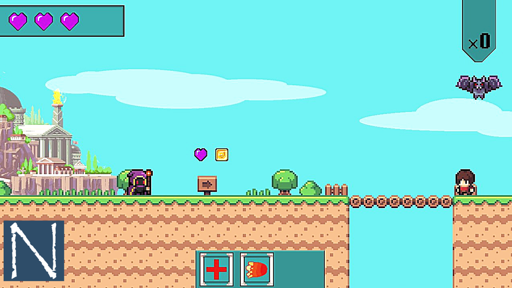
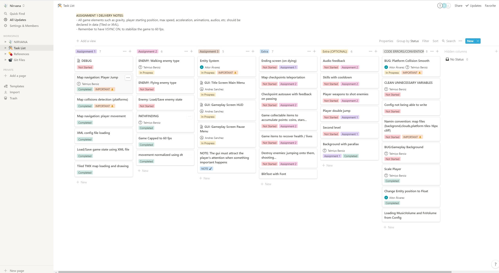
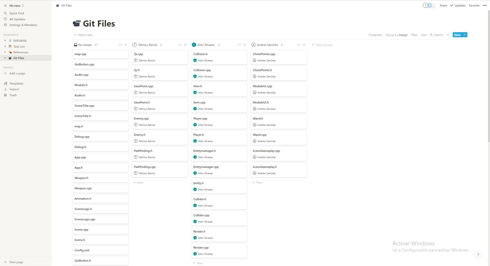

# TEMPLARIA

 
 
## Description

 We are team Nirvana and this is our 2D platformer video game prototype made by students from the CITM University on Barcelona. It is developed in c++ on visual studio using SDL library. Hope you enjoy it!
 
## Key Features
 - Load/Save game state using XML file.
 - Tiled TMX map loading and drawing (orthographic).
 - Map collisions detection (platforms).
 - Map navigation: player movement and jumping.
 - Ending screen (on dying).
 - Title screen (press ENTER to start).
 - Player walk/jump/die animations.
 - 1 second invulnerability frame.
 - Heal and Fireball player abilities.
 - Ending screen (on dying).
 - Win screen on winning.
 - Logo screen.
 - Frame Time Control.
 - Deltatime on Move.
 - Destrucible Enemies.
 - Game Items: Health / Lives.
 - Collectable Items: Coins / Hearts.
 - Double jump.
 - Frame Time Control.
 - Checkpoints autosaves the game
 - Checkpoints Teleports
 - Player Weapon
 - Cooldown Skills.
 - Audio Feedback
 - Entity system already implemented, used to create all the objects and enemies as well as the firebolt, but we are having some trouble with this last one's collider.
 - Level 2 is already created and implemented but still too buggy, so we decided not to give access to it just yet.
 - Visual full GUI with information.
 - Functional GUI with settings, continue, play, exit and credits.

 
## Controls

 - WASD for movement.
 - Weapon: Mouse Right Click to change a coin with an extra live. Limited to 5.
 - E: Open teleport menu and Arrows to move arround. Press T to telepor to the selected location.
 - SPACE for jumping
 - H to heal the player, it has cooldown.
 - Jto shoot a fire ball, it also has cooldown
 - F1/F2 Start from the first/second level.
 - F3 Start from the beginning of the current level.
 - F5 Save the current game state.
 - F6 Load the previous state (even across levels).
 - F9 View colliders / logic.
 - F10 God Mode (fly around, cannot be killed).

## Developers

 - Aitor Àlvarez - Developer.
 - Telmo Beroiz - Developer.
 - Andrés Sànchez - Developer.  

## License

This project is licensed under an unmodified MIT license, which is an OSI-certified license that allows static linking with closed source software. Check [LICENSE](LICENSE) for further details.

 - Players spritesheets by Modsama on gamedevmarket.net
 - Tileset by Modsama on gamedevmarket.net
 - SDL License
 - PUGI License
 - Optick License
 
 ## Working Method
 
This project has used the website notion.so to apply the Kanban working method and thus be able to organize and fulfill correctly established goals.

 

 
